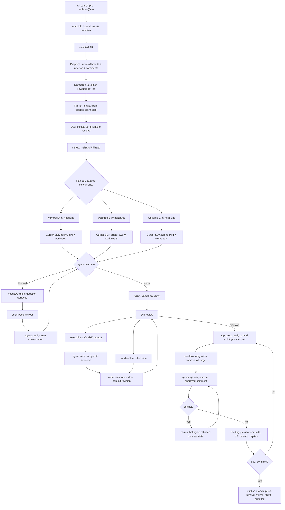

# Airlock — Architecture and Implementation Plan

> Build Airlock as a standalone Electron app that ingests every comment on a GitHub PR into one filterable tree, resolves selected ones with a Cursor SDK agent in its own isolated git worktree in parallel, then lets you review each candidate patch and revise it three ways — hand-editing, a Cursor-style Cmd+K prompt scoped to selected lines, or answering a question the agent halted on — before squash-merging the approved ones onto a target branch.

**This file is the single source of truth for progress.** Work phase by phase, check items off in the checklist below as they complete, and update this document when a decision changes. The coding rules live in [AGENTS.md](AGENTS.md) and apply to every phase.

## Implementation checklist

### Phase 0 — Standards first

- [x] `agents-md` — Adapt cjenkalo/CLAUDE.md into AGENTS.md for Airlock: keep the stack-agnostic code rules, add the Electron process-boundary and trust-boundary sections, resolve the interface-vs-z.infer tension, swap formatNumber/BigNumber for formatDuration/formatBytes, and state i18n / precision / Next / ORM as explicitly not applicable
- [x] `code-rules` — Port the four modular rules into `.cursor/rules/` adapted for Electron: core-principles, typescript-standards, react-patterns, state-management (renderer paths, TanStack-over-IPC, no Next.js specifics), each scoped narrower than AGENTS.md rather than duplicating it
- [x] `lint-tooling` — Add ESLint flat config (typescript-eslint 8, eslint-plugin-react-hooks 7) + Prettier (semi, singleQuote, trailingComma all, printWidth 100); add lint script; reformat the semicolon-free scaffold once; enforce renderer boundaries mechanically (no-restricted-imports zones: screens cannot import other screens, modules and shared layers cannot import screens, shared layers cannot import modules; plus import/no-cycle across modules) and set up the `@renderer/*` and `@shared/*` path aliases in tsconfig + electron.vite so the zones have stable paths to match
- [x] `tailwind-setup` — Add Tailwind v4 via @tailwindcss/vite plugin and `@import 'tailwindcss'`; port src/renderer/src/styles.css design tokens into a `@theme` block; add prettier-plugin-tailwindcss
- [x] `deps-scaffold` — Add runtime deps (@cursor/sdk, @tanstack/react-query, zustand, zod, @monaco-editor/react, monaco-editor, simple-git); no GitHub client library since gh covers it; fix CSP in src/renderer/index.html to add worker-src for Monaco workers

### Phase 1 — Discover, read and list

- [x] `secrets-store` — Build src/main/store.ts: safeStorage for CURSOR_API_KEY as the only stored secret, plus JSON run state in app.getPath('userData')
- [x] `gh-cli-layer` — Build src/main/ghCli.ts: resolve the gh binary explicitly since Electron does not inherit shell PATH, invoke via execFile, map exit codes and stderr into typed errors (missing binary / unauthenticated / rate limited / network / no repo access), and run a gh auth status preflight
- [x] `ipc-bridge` — Build src/main/ipc.ts typed channel registry and replace the versions-only stub in src/preload/index.ts with the typed bridge
- [x] `comment-model` — Define PrComment in src/shared/comments.ts as a Zod-backed discriminated union on kind, so only inlineThread carries anchor + resolution state; derive types with z.infer
- [x] `github-fetch-all` — Build src/main/github.ts: three separate `gh api graphql --paginate` queries (reviewThreads, reviews, comments) since --paginate follows a single cursor; parse stdout through Zod; normalize into PrComment[]. **Read path only** — resolveReviewThread, unresolveReviewThread and the reply mutation moved to phase 6, because the trust boundary requires every out-of-sandbox call to take a type-level confirmation and append to the audit log, and neither exists until phase 5. Building them here would create an unaudited path to GitHub
- [x] `query-layer` — Set up TanStack Query with IPC-backed queryFns and a query key factory in lib/; useQueryPrComments hook lives in modules/comments since that module owns the domain
- [x] `pr-discovery` — Build src/main/discovery.ts: `gh search prs --author=@me --state=open` with JSON output; local repo registry populated by scanning a configured root for .git dirs plus manual folder-picker adds; match PRs to clones by normalizing all remote URLs to an owner/repo key, not just origin, so fork workflows resolve
- [x] `comment-list-ui` — Settings screen showing gh auth status with remediation and repo registry config, PR list from discovery with a not-cloned marker, URL paste as escape hatch. Unresolved counts are **not** on the list rows — see the as-built note below
- [x] `comment-tree` — CommentTree.tsx with useCommentTree/useTreeExpansion: directory/file/comment hierarchy, single-child chains collapsed, parent nodes rolling up descendant count and most-urgent state, unanchored comments in a pinned PR-conversation node, directory-level multi-select, filters pruning the tree, expansion persisted per PR
- [x] `attention-budget` — Badge hierarchy so rows do not carry eight equal badges (run state strong and always visible, secondary attributes muted and only when true, tier only pre-run, guardrail flags loud because rare); default-expand only blocked or flagged subtrees, self-collapse applied/noActionNeeded, sort needsDecision first, and show a triage counter
- [x] `comment-filters` — Filter bar (unresolved-only, hide bots, hide outdated, by author, by file) filtering client-side over the full fetched set, not at fetch time
- [x] `session-restore` — Persist and restore the last selected PR, its comment list state, and the user's selection so a restart is not a reset; add a new-since-last-viewed marker on the queue for results that accumulated in the background

#### As built: four notes

- **`github.ts` is the read path only.** The mutations moved to phase 6 for the reason recorded on that item. Nothing in phase 1 can reach GitHub except through a read.
- **No unresolved-comment count on PR list rows.** `gh search prs` cannot return one, and a per-PR `reviewThreads` query would mean N network calls on every discovery refresh against the more tightly rate-limited search path. The count comes from the comment set once a PR is selected, where it is already fetched. Revisit only if a single batched GraphQL query over the search result proves cheap.
- **No `CURSOR_API_KEY` entry UI.** "Secrets never cross IPC" is an invariant, and phase 1 needs only `gh`, so the renderer can ask whether a key is set and nothing more. How the value is supplied is a deliberate phase 2 decision rather than something to improvise here.
- **Attention budget and session restore are wired ahead of their inputs.** Both are phase 1 items that reference runs, which do not exist until phase 2. The behaviour is implemented over `RunState` and reached through an optional `runStateByCommentId` map that is empty for now, and `lastViewedAtByPr` is persisted before the queue that will render the new-since marker. That is the item as written, not speculative generality — but the run-driven paths are unexercised until phase 2.

### Phase 2 — One agent, one worktree

- [x] `worktree-engine` — Build src/main/worktree.ts: `git fetch refs/pull/N/head` first so same-repo and fork PRs both work, then create worktrees at that SHA via simple-git, commit, diff, squash-merge, revert-to-revision
- [x] `worktree-cleanup` — Three-step teardown (worktree remove, then `git branch -D` of the scratch branch which remove does not delete, then worktree prune); never force-remove a dirty worktree, surface it as unlanded work instead; only tear down terminal states, never running/revising/ready/needsDecision since local agent resume needs the cwd
- [x] `worktree-reconcile` — Startup reconciliation: diff `git worktree list --porcelain` against persisted run state, tear down orphans, mark runs whose worktree vanished as broken, prune dead registrations; surface total sandbox disk usage with a manual clean-up-all action
- [x] `sandbox-containment` — Build src/main/sandbox.ts: enable extensions.worktreeConfig and set an invalid remote.origin.pushurl per worktree; set worktree-scoped user.name/user.email to the user's identity; scrub GIT_AUTHOR__/GIT_COMMITTER__/EMAIL and GH_TOKEN/GITHUB_TOKEN from the agent env and point GH_CONFIG_DIR at an empty dir; settingSources empty; assert gated ops carry a confirmation
- [x] `agent-runner` — Build src/main/agent.ts: Agent.create (never Agent.prompt) with local cwd = worktree, persist agentId for Agent.resume, stream events over IPC, cancel guarded by run.supports, guaranteed disposal, distinguish CursorAgentError from result.status error
- [x] `prompt-builder` — Build src/main/prompt.ts: anchored comments get path/line/diffHunk context; unanchored comments get a locate-the-code-first instruction; both include the halt-and-ask protocol for genuine ambiguity and the instruction to write .airlock/summary.json with a draft commit subject and details
- [x] `commit-identity` — Resolve the user's git identity from effective repo config and fail preflight if unset; author and committer both set to the user on every commit; no Co-authored-by trailer for the agent
- [x] `commit-messages` — Assemble the squashed landing commit message from the agent's summary.json subject plus provenance (comment author, file/line, quoted comment body, PR and thread URLs); template fallback when summary is missing or malformed; editable in the landing preview
- [x] `run-state-machine` — Build src/main/runState.ts: explicit state machine (queued/running/needsDecision/ready/revising/noActionNeeded/failed/approved/applied) with revision counter and trigger origin, persisted to the JSON store
- [x] `phase2-single-run` — Wire one comment end-to-end (worktree → agent → streaming transcript → Monaco DiffEditor showing candidate patch)

#### As built: three notes

- **Containment is process-wide, not per-child.** See the inverted-direction note under "The agent is contained, not merely instructed" — the SDK gives local agents no env override, so the original design could not have worked.
- **`squash-merge` is not in `worktree.ts` yet.** The `worktree-engine` item listed it, but its only caller is the phase 5 integration branch, and a squash-merge onto anything real is a gated operation with no confirmation type consumer until then. `commit`, `diff` and `revert-to-revision` are all present; the merge lands with `landing.ts`.
- **`commitMessage.ts` is built but has no caller.** The `commit-messages` item belongs to the landing flow, which is phase 5. It is a pure function with no I/O, so it is verifiable in isolation and carries no risk sitting unused; `landing.ts` will call it. The "editable in the landing preview" half is phase 5 by definition.

### Phase 3 — Parallel queue and routing

- [x] `model-router` — Build src/main/router.ts: pure heuristic mapping PrComment to mechanical/standard/complex from anchoring, body length and verb, diffHunk size, design vocabulary, and reply depth; resolve tier to model via Cursor.models.list() with the mapping configurable in settings, never hardcoded; all tiers default to the unlimited lane (Auto / Composer 2.5)
- [x] `tier-badges` — Show the suggested tier as a badge on every comment before running, overridable per comment and per batch; mark any frontier-model selection as pool-spending so cost is never incurred accidentally
- [x] `escalation` — Auto-escalate only on result.status error or an empty diff, and only within the unlimited lane by raising reasoning effort; crossing to a frontier model is a manual, labelled action; escalation starts a fresh agent against the worktree reset to base, warning first if hand-edits would be discarded
- [x] `parallel-queue` — Build src/main/queue.ts concurrency-capped scheduler calling the router per comment; queue UI with live per-run state badges and cancel
- [x] `stop-all-and-timeout` — Stop-all control cancelling every active run (guarded by run.supports cancel) with disposal; per-run max duration after which the run is cancelled and marked failed with a timeout reason distinct from an agent error

#### As built: three notes

- **The tier heuristic lives in `src/shared/tier.ts`, not `src/main/router.ts`.** The tier renders as a badge on every comment *before* anything runs, so the renderer needs it; an IPC round trip per row for a pure function over data the renderer already holds would be absurd. `router.ts` keeps the SDK-facing tier-to-model resolution, which is the half that genuinely belongs in main.
- **Reasoning effort is not on `RunRecord`,** so repeated *manual* escalations climb the effort ladder through a session-scoped map in `queue.ts`. After a restart the ladder restarts from the tier's configured position. The clean fix is a field on the run record, written where `agentId` already is; it was not worth the cross-file churn mid-phase. Attribution of spend is unaffected — tier, model and lane are all persisted.
- **`resetWorktreeToBase` is `reset --hard` only,** so an untracked file left behind by a failed attempt survives into the escalated run. Removing it would need `git clean -f`, and the never-force rule outranks the tidiness. Worth revisiting only if it produces a real misdiagnosis in practice.

### Phase 4 — Revise

- [x] `decision-protocol` — Surface the question + options and send the reply through agent.send to continue. **Detection landed early, in phase 2**: the phase 2 prompt already instructs the agent to halt and write `.airlock/decision.json`, so without a watcher a halted run would simply hang until its timeout. `src/main/decision.ts` therefore ships with the run engine, and what remains here is the reply UI and the continuation path
- [x] `auto-mode` — Per-session auto mode toggle, off on every app start; pre-selects the recommended comment set, takes the heuristic tier silently, and auto-answers blocking questions with the agent's top option; never approves diffs, never crosses the landing gate or into the paid lane; capped auto-answers per run before parking for a human
- [x] `auto-mode-visibility` — Record auto-decisions per run (what was chosen, what the alternatives were) and render them beside the diff in review; show the toggle state and a count of deferred decisions awaiting review
- [x] `hand-edit-diff` — Editable modified side of Monaco DiffEditor, debounced write-back to the worktree file, re-diff and commit as a revision
- [x] `targeted-edits` — InlinePrompt.tsx selection-scoped revision via agent.send on the same agent: prompt carries path, line range, and selected content verbatim (content is the anchor since line numbers drift), framed differently for modified-side (change this) vs original-side (you missed this) selections; defaults to the free mechanical tier, sends serialized per run, result scope-checked by guardrails, commits as a revision
- [x] `revising-state` — Add revising run state so the right pane keeps the existing diff dimmed with inline agent progress instead of swapping to a transcript; also expose a whole-patch follow-up prompt in ready state, unifying decision reply / follow-up / targeted edit onto one agent.send path
- [x] `revision-history` — One commit per revision in the worktree as an audit trail, with revert-to-revision; squashed at apply time
- [x] `guardrails` — Build src/main/guardrails.ts running on every patch that reaches ready and again on the combined landing diff: configurable protected-path list (lock files, generated output, .github/workflows, .env*, vendored trees, .cursor/rules), credential-shaped secret scan, and tier-versus-diff-size plus out-of-anchor-path mismatch; flags block approval until acknowledged and the acknowledgement is audited
- [x] `review-shortcuts` — useReviewShortcuts hook for keyboard-driven review (j/k over visible tree rows skipping collapsed subtrees, left/right collapse-expand, a approve, r reject, e focus diff, ]/[ hunk nav, Cmd+K inline prompt on selection matching Cursor's binding, d dismiss, ? help); every shortcut has a visible button equivalent and landing confirmation stays a click

#### As built: five notes

`decision-protocol` and `revising-state` landed together, because they are one mechanism: `runs:continue` resumes the run's existing agent, and the run's state decides whether that means answering a question (`needsDecision` → `running`) or revising a patch (`ready` → `revising`). Doing the decision reply without the follow-up would have built the same path twice.

Two consequences worth knowing before the remaining items are picked up:

- **`approved` accepts a continuation in main but is not offered one in the UI.** The whole-patch follow-up is scoped to `ready` per the entry-point table above. Widening it is a one-line change once the approve action exists in phase 5.
- **`DecisionPrompt` and `FollowUpPrompt` each carry their own textarea styling.** That is the second consumer, so the promotion rule now points at a shared prompt-field primitive in `components/`. It was left duplicated deliberately rather than promoted mid-slice; `targeted-edits` will be the third consumer and is the right moment to extract it.

`guardrails` landed next, since phase 5 must not be able to reach a real branch before the checks exist. Two parts of that item are deferred by phase ordering rather than by oversight:

- **The acknowledgement is not yet audited.** `audit.ts` is a phase 5 module, so the acknowledgement is recorded on the run but not appended to an audit log. The audit write is a one-line addition at `acknowledgeGuardrail` once that module exists.
- **"Blocks approval" has nothing to block yet.** The approve action is phase 5. `hasUnacknowledgedFlags` exists and the UI already states how many findings remain before the patch can be approved, so phase 5 wires into the gate rather than retrofitting one.

The combined-landing-diff pass is also phase 5 by definition; `inspectCandidatePatch` was deliberately written without a per-run assumption so it can run against that diff unchanged.

The rest of the phase landed together. Four further notes:

- **Only the first agent turn had a decision watcher.** An agent that halted again while answering — common, since an answer often exposes the next fork — left its decision file unread and the run settled as `ready` over an unfinished patch. Fixed: a fresh halt wins over the settled outcome on a continuation exactly as it does on the first turn.
- **`Cmd+K`, `[` and `]` belong to the editor, not the window.** The shortcut hook documents them in its map but supplies no handler, and it ignores a binding it cannot handle, so the keys reach Monaco untouched. Registering per inner editor is also what makes a selection's side known rather than guessed from focus.
- **`a` and `r` are documented but unbound**, carrying no key at all rather than a key with no handler. Approve and reject arrive with the review gate; a binding that swallowed the keypress to do nothing would be worse than none.
- **The auto-answer cap counter is the recorded decisions themselves.** It survives a restart and a retry of the same run, where a process counter would silently reset and let the drift resume.

Two known gaps carried into phase 5: there is still no visible Dismiss control for the `d` shortcut, and `approved` accepts a continuation in main but is not offered one in the UI until the approve action exists.

### Phase 5 — Land, gated

- [x] `review-approve` — Approve/reject per comment, where approved means ready to land and nothing has landed; bulk approve/reject/dismiss by tier or state that only ever moves runs to approved, never lands
- [x] `sandbox-integration` — Build src/main/landing.ts to assemble the integration result in a sandbox worktree off the target branch, squash-merging each approved comment branch, so conflicts surface without touching the real repo
- [x] `conflict-rerun` — On squash-merge conflict, recreate worktree from updated integration state and re-run that comment's agent
- [x] `landing-gate` — LandingPreview showing commits, combined diff, target remote/branch, threads to resolve by URL, and reply text; nothing executes without confirmation
- [x] `audit-log` — Build src/main/audit.ts append-only log of every out-of-sandbox action plus guardrail acknowledgements and landing undos, surfaced in AuditLog.tsx

#### As built: five notes

- **`rejected` is a real run state.** The approval model talks about rejection but `RUN_STATE` had no such member. It is terminal, keeps the record and the worktree until the run is dismissed, and is reversible back to `ready` — turning a resolution down is a judgement, not a destructive act. Every exhaustive switch failed to compile until it accounted for it, which is what they are for.
- **`approved` gained an edge back to `running`.** Without it a conflict re-run could not start at all. Re-entering work is what revokes the approval: what was approved no longer applies to the branch it must land on.
- **The audit log is JSON Lines in its own file**, not an array in the state store. The store replaces its whole file per write, which risks at most the newest write for state that can be recomputed — the wrong trade for a record where earlier history must survive a later crash, and where a torn or older-version line should stay isolated rather than failing the whole read.
- **The confirm control is rendered, gated and inert.** Executing is phase 6 and there is no execute channel, so the button carries no `onClick` at all and says so in one line. A dead button that looked live, or a faked success, would be worse than an honest absence. Conflicts remove it entirely rather than disabling it.
- **The audit log got its own screen**, a third alongside Workspace and Settings. It is a record rather than a preference, and it is the surface someone opens to answer what the tool has actually done to their repository.

Carried into phase 6: `executeLanding` already requires a `SandboxConfirmation` and mints a landing id so the publish, push, thread-resolve and reply entries share one; `github.ts`'s mutations are still deliberately absent; and there is still no visible Dismiss control for the `d` shortcut.

### Phase 6 — Close the loop

- [x] `close-loop` — Behind the gate, publish the integration branch, push it (never the target branch, never force), resolveReviewThread, optional reply comment
- [x] `undo-landing` — Undo the most recent landing from its audit record (delete pushed branch, unresolveReviewThread each resolved thread, return runs to approved); offered only while it is the latest landing, states plainly that a posted reply cannot be unposted, and is itself audited

#### As built: four notes

- **`applied` gained an edge back to `approved`.** Undo genuinely returns a run to approved — the branch was deleted and its threads unresolved — so it goes through the state machine rather than rewriting the record to look right.
- **A landing is not atomic, and that is stated rather than hidden.** Each step audits after it succeeds; a failure propagates without rolling back the log, so undo still sees exactly what happened. Recovery is undo-then-land-again rather than retry: re-assembly rebuilds the branch with new commit shas, and a second push would be a non-fast-forward, which is not forced.
- **Undo is derived from the log, not from extra bookkeeping.** `unresolveReviewThread` takes the same `PRRT_` node id `resolveReviewThread` consumed. A landing group containing `LANDING_UNDONE` is spent, one without `BRANCH_PUSHED` never reached the remote, and already-unresolved threads are subtracted so an interrupted undo is retryable.
- **Known limitation: one integration branch per PR.** A second landing on the same PR rebuilds that branch from the target, and its push would be rejected as a non-fast-forward rather than forced. Undoing the first landing first is the supported path. Fixing it means a per-landing branch name, which the preview and the conflict re-run both key off.

### Phase 7 — Optional automation

- [ ] `watcher` — Build src/main/watcher.ts polling loop with an updatedAt short-circuit before the comment queries, persisted last-seen comment IDs per PR, and head-SHA change detection that marks existing runs stale
- [ ] `automation-rules` — Build src/main/automation.ts author-allowlist trigger rules, off by default, free lane only, deduped by comment ID, capped per hour, paused during a landing; tag runs with trigger manual or auto
- [ ] `automation-ui` — AutomationSettings.tsx for the enable toggle and author allowlist; native notification when auto-runs finish; queue distinguishes auto from manual runs
- [ ] `no-action-state` — Add noActionNeeded run state so an auto-triggered run producing an empty diff resolves cleanly instead of auto-escalating forever

### Phase 10 — Ship it

- [ ] `single-instance` — Take the single-instance lock and focus the existing window instead of starting a second process; two instances would share one JSON store and one set of worktrees and corrupt both
- [ ] `app-menu` — Build a real application menu. On macOS an Electron app with no Edit menu has no working Cmd+C/V/X/A anywhere, including every text field this app has, so this is a correctness fix rather than chrome
- [ ] `app-identity` — App icon, product name, description, bundle id, category and author metadata; the About panel and the dock/taskbar entry
- [ ] `error-boundary` — A renderer error boundary so an uncaught render error shows something recoverable instead of a white window, and a main-process handler for unhandled rejections that does not take the app down silently
- [ ] `window-state` — Remember window size and position across restarts, clamped back onto a currently-connected display
- [ ] `packaging` — electron-builder config producing a macOS build, with the icon, the metadata and the entitlements wired; note plainly that it is unsigned and what that means for the person opening it
- [ ] `readme` — A README written for someone deciding whether to run this, not for someone who already knows the architecture

### Phase 9 — Second opinion

- [ ] `opinion-model` — Define the verdict model in src/shared/opinion.ts: Zod-backed, with verdict (addresses/partial/misses/harmful), concerns as plain strings, and the run it belongs to; treated as an agent-written file like decision.json
- [ ] `opinion-prompt` — Build the reviewer prompt in src/main/prompt.ts: the original comment and the candidate diff, explicitly without the first agent's transcript or summary, plus the instruction to write .airlock/opinion.json and to change nothing
- [ ] `opinion-runner` — Run a fresh agent in the run's worktree, parse the verdict, and verify the patch is byte-identical afterwards; a reviewer that edited anything is itself a finding
- [ ] `opinion-ui` — Render the verdict and its concerns beside the diff alongside the guardrail flags and auto-decisions, and offer it per run and per batch; never blocking

### Phase 8 — Learn from the comments

- [ ] `convention-model` — Define the rule model in src/shared/conventions.ts: Zod-backed, with scope (repo/global), category, imperative rule text, rationale, evidence refs, and state (candidate/confirmed/rejected/exported)
- [ ] `convention-capture` — Record every ingested comment as evidence in the store keyed by repo and comment id, with the resolving diff and run outcome attached once one exists; dedupe on comment id so re-fetching a PR never inflates evidence
- [ ] `convention-distill` — Build src/main/conventions.ts: batch distillation running one free-lane agent over unprocessed evidence to propose candidate rules, merging into existing rules by bumping evidence instead of duplicating, and never re-proposing a rejected rule
- [ ] `convention-promotion` — Recurrence threshold before a candidate is surfaced as confirmable, and promotion of a repo rule to global on its second repo, mirroring the renderer's promote-on-second-consumer rule
- [ ] `convention-review-ui` — modules/conventions: rules grouped by category with evidence links back to the source comments, confirm/reject/edit per rule, and a preview of exactly what export would write
- [ ] `convention-export` — Gated, audited write of confirmed rules to the target repo's .cursor/rules/learned-conventions.mdc and of global rules to a standalone user-level file; takes a confirmation argument at the type level, previews as a file diff, and is recorded as a deliberate protected-path exception

---

## Why standalone, not a Cursor extension

The workflow is a **batch pipeline with a review gate**, not a conversation: every comment on the PR is ingested into one list, you select which ones to act on, each selected one produces an isolated candidate patch, you review and revise them individually, and only an explicit confirmation lands them. Two things make an editor extension the wrong host:

- **Isolation requires N concurrent git worktrees.** An extension host is bound to one workspace folder; the whole design fights it.
- **The primary surface is a queue dashboard**, not an editor pane. You need to see 12 runs at once with independent status.

You are not rebuilding Cursor. The AI editing is rented via `@cursor/sdk` (v1.0.24 on npm), which runs real Cursor agents against an arbitrary `cwd` — exactly what per-worktree isolation needs. What you build is the orchestration, review, and approval layer around it.

## The name is the architecture

Renamed from "PR Resolve", which described the wrong product. "Resolve" implies the tool resolves comments for you, when every structural decision here exists to keep that judgment yours — and in a tool that both detects merge conflicts and calls `resolveReviewThread`, the word was already carrying two other meanings.

An airlock is a chamber with two doors that are never open at once. Work accumulates inside, gets inspected, and passes through on one deliberate action. That is precisely the sandbox → guardrails → confirmation gate → real repo flow below, so the metaphor is load-bearing rather than decorative, and it supplies consistent vocabulary:

- scratch branches are `airlock/<pr>/<commentId>`
- the agent's protocol directory is `.airlock/`, holding `decision.json` and `summary.json`
- the confirmation gate is the **outer door**; landing is **cycling through**

## Approval model

Nothing leaves the sandbox without an explicit, reviewed decision. This is an invariant the architecture enforces, not a policy the UI politely follows.

**Sandbox** — throwaway worktrees under a scratch directory and their scratch branches (`airlock/<pr>/<commentId>`). Agents write here freely; commits here need no approval because nothing is reachable from a real branch and deleting the worktree erases it.

**Outside the sandbox** — the real repo's branches, the git remote, and the GitHub API. Every one of these requires your confirmation:

- creating or committing to the integration branch
- pushing anything
- `resolveReviewThread`
- posting any reply comment

Approving a resolution marks it **ready to land**, and nothing more. Landing is a separate action with a preview.

### The integration branch is built in the sandbox first

To preview a landing honestly you need real conflict detection, which means actually performing the merges. So the integration result is assembled in a _sandbox_ worktree: branch off the target, `git merge --squash` each approved comment branch, and surface any conflict there. Only on confirmation is that ref published into the real repo — so conflicts are found, and can be re-run, while the real repo is still untouched.

The landing preview shows exactly what will happen: the commits to be created with their messages (editable in place), the combined diff, the branch name and remote it will be pushed to, every thread that will be resolved listed by URL, and the text of every reply that will be posted. Nothing runs until you confirm.

**The target branch is never pushed to directly.** Landing pushes the integration branch as its own branch, so the result is always reviewable as a PR and is reversible — see undoing a landing below, which makes that reversal an actual operation rather than a claim. Force-push is never used anywhere.

Containment keeps the agent off the network; it does not vet what the agent wrote. Guardrail checks on the candidate patch cover that second half.

### The agent is contained, not merely instructed

Worktrees share the parent repo's remotes and credentials, so an agent with shell access could push or comment on its own. Prompt instructions telling it not to are a request, not a guarantee, so containment is structural:

- `extensions.worktreeConfig` is enabled and each worktree gets `remote.origin.pushurl` set to an invalid value, so a push attempt fails at the git level rather than relying on the agent's cooperation.
- **The agent's `gh` is de-authenticated.** Using the CLI for auth means the credential is ambient, so an agent could otherwise just run `gh pr comment` itself. `GH_CONFIG_DIR` points at an empty directory and `GH_TOKEN` / `GITHUB_TOKEN` are cleared, so `gh` finds no credentials in that subprocess while the main process keeps working normally.

  **As built, the direction is inverted.** The above assumed a per-child environment, but `@cursor/sdk` has no env override for local agents: `LocalAgentOptions` exposes only `cwd`, `settingSources`, `sandboxOptions` and `customTools`, and `env` appears solely on `McpServerConfig` and the cloud options. A local agent inherits the main process's environment, so an env object that cannot be handed to it is not containment — it merely looks like it. Containment is therefore applied to the whole main process at startup, before anything can spawn a subprocess, and `ghCli` is the single explicit opt-out that restores main's own credentials for its own calls. This is the stronger arrangement anyway: every subprocess is contained unless it opts out, so a child added later is contained by omission rather than exposed by it.
- `local.settingSources: []` (the SDK default) keeps ambient user, project, and team settings out of the run.
- The prompt still forbids git and network commands, as defense in depth rather than the primary control.

Every action taken outside the sandbox is appended to an audit log with a timestamp, so the history of what this tool did to your repo is always inspectable.

## Core pipeline



Everything above the confirmation gate happens inside the sandbox. Only the final `Land` step touches the real repo or GitHub.

## PR discovery

No URL pasting in the normal flow. `gh search prs --author=@me --state=open --json ...` enumerates your open PRs across every repo you can see, and the app lists them with repo, title, number, and unresolved comment count.

URL paste stays as an escape hatch for anything outside that filter.

### Discovery and resolution have different requirements

Discovery is global; **resolution needs a local clone**, because worktrees do. So a discovered PR is only actionable once it maps to a repo on disk. PRs with no local clone are still listed and marked as such, with cloning offered as an explicit action rather than happening implicitly.

The local repo registry is populated two ways, both persisted in the store: scanning a configured root folder for directories containing `.git`, and adding individual repos through a folder picker.

Matching a PR to a local repo reads that repo's remotes, normalizes the URL (`git@host:owner/repo.git`, `https://host/owner/repo.git`, and `ssh://` forms all reduce to an `owner/repo` key), and compares. **All remotes are checked, not just `origin`** — in a fork workflow the PR belongs to the upstream repo while `origin` points at your fork, so matching on `origin` alone would fail exactly when you are contributing to someone else's project.

### Worktrees fetch the PR head ref explicitly

An earlier assumption that the PR head is already available locally does not hold: the branch may never have been fetched, and for a cross-repository PR it lives on a fork you have no remote for. GitHub exposes `refs/pull/<number>/head` on the **base** repo, so worktree creation runs `git fetch <remote> refs/pull/<number>/head` first and branches from the resulting SHA. That works uniformly for same-repo and fork PRs.

Fetching is a read-only network operation, so it is not a gated action.

### Rate limits shape the refresh strategy

GitHub's search API is rate limited more tightly than the regular API, so discovery is a manual or interval refresh rather than a tight poll. The phase 7 watcher polls the specific PRs you are working on — via the cheap `updatedAt` check — instead of re-running a global search.

## Comment ingestion

"All PR comments" spans three separate GraphQL collections on `PullRequest`, which is why this needs a normalization layer rather than a single query mapped straight to the UI:

- `reviewThreads` — inline comments anchored to a file and line. Only these carry `isResolved` / `isOutdated`, and only these can be resolved via API.
- `reviews` — the summary body written when submitting an approve or request-changes. Skip entries with an empty `body`, which is most of them.
- `comments` — top-level PR conversation, no code anchor.

These are fetched as **three separate `gh api graphql --paginate` calls**, one per collection. That split is forced by the tool: `--paginate` follows a single `$endCursor`, so one query containing three paginated connections cannot be auto-paginated. Three queries also map cleanly onto the three normalizers.

All three are then normalized into one model in `src/shared/comments.ts` (shared because both processes need the type). It is a **discriminated union**, not one flat shape with optional fields, so that "only inline threads have an anchor and resolution state" is enforced by the compiler rather than documented in a comment:

```ts
interface PrCommentBase {
  id: string;
  body: string;
  author: { login: string; isBot: boolean };
  createdAt: string;
  replies: { author: string; body: string }[];
}

export interface InlineThreadComment extends PrCommentBase {
  kind: 'inlineThread';
  anchor: { path: string; line: number | null; diffHunk: string };
  isResolved: boolean;
  isOutdated: boolean;
}

export interface UnanchoredComment extends PrCommentBase {
  kind: 'reviewBody' | 'conversation';
}

export type PrComment = InlineThreadComment | UnanchoredComment;
```

The schemas are declared in Zod and the types derived via `z.infer`, so GraphQL responses are validated at the boundary instead of trusted.

Two decisions follow from this shape:

- **Fetch everything, filter in the renderer.** Filters (unresolved-only, hide bots, hide outdated, by author, by file) are a view concern over the full set. Filtering server-side would mean a refetch per toggle and would make counts like "3 of 21 resolved" impossible.
- **Bot detection from the GraphQL `author.__typename === 'Bot'`,** plus a login suffix check for `[bot]`, since some bots post through user accounts. Bots are shown by default and tagged, with a toggle to hide.

### Driving the `gh` CLI from Electron

Shelling out to a CLI from a desktop app has three failure modes that all need handling in `src/main/ghCli.ts`:

- **PATH is not inherited.** A macOS app launched from Finder or the dock gets a minimal PATH, so a bare `gh` fails even though it works in your terminal. The binary is resolved explicitly by probing the usual locations (`/opt/homebrew/bin/gh`, `/usr/local/bin/gh`, `/usr/bin/gh`) and falling back to querying a login shell. The resolved path is cached for the session.
- **Failures arrive as exit codes and stderr, not typed exceptions.** These get mapped into distinct cases so the UI can respond usefully: binary missing (`ENOENT`), not authenticated, rate limited, network unreachable, and repo-not-accessible. "gh is not installed" and "your token expired" must not collapse into one generic error.
- **A preflight check runs before phase 1 does anything.** `gh auth status` confirms the CLI is present and authenticated, and the settings screen shows the exact remediation command when it is not. The current keyring token is invalid, so `gh auth login` is a prerequisite.

Output is parsed with `execFile` (never a shell, so no argument-quoting issues), and every response goes through Zod, since stdout from a subprocess is untyped by definition.

### Anchored vs unanchored drives prompt construction

An inline thread gives the agent `path`, `line`, and `diffHunk` — near-perfect context. A top-level comment gives it prose and nothing else, so the agent must locate the relevant code itself. `src/main/prompt.ts` branches on `anchor` presence: anchored prompts pin the agent to the exact hunk, unanchored prompts instruct it to search the repo first and report what it targeted. Unanchored comments are marked in the UI so a surprising diff is immediately explainable.

Unanchored comments are also frequently not actionable at all ("LGTM, nice work"). The list is where you triage that — nothing is sent to an agent without explicit selection.

## Revision and decisions

A resolution is never take-it-or-leave-it. Each run carries an explicit state, and several of them are interactive:

```ts
export const RUN_STATE = {
  QUEUED: 'queued',
  RUNNING: 'running',
  NEEDS_DECISION: 'needsDecision', // agent halted on ambiguity, waiting on you
  READY: 'ready', // candidate patch exists, reviewable and editable
  REVISING: 'revising', // patch exists and the agent is amending it
  NO_ACTION_NEEDED: 'noActionNeeded', // ran, produced nothing, and that was correct
  FAILED: 'failed',
  APPROVED: 'approved', // reviewed and ready to land; nothing has landed
  APPLIED: 'applied', // landed after an explicit confirmation
} as const;

export type RunState = (typeof RUN_STATE)[keyof typeof RUN_STATE];
```

A typed `as const` object rather than an `enum`, per `typescript-standards.mdc`.

`needsDecision` is deliberately not an error state. An agent that hits a real fork should stop rather than guess and hand you a confident-looking diff built on the wrong assumption.

### Halt-and-ask protocol

`src/main/prompt.ts` instructs the agent that when it cannot resolve an ambiguity, it must **not** guess — it writes `.airlock/decision.json` in its worktree and stops. (The same directory carries `summary.json`, the agent's draft commit message; see commit messages below.)

```json
{ "question": "...", "options": ["add a compat shim", "make it breaking"], "context": "..." }
```

Options are ordered **best-first**, which is what lets auto mode take the top one meaningfully rather than arbitrarily.

A file, not a parsed sentinel in the response text, because format compliance in prose is unreliable while a file either exists or does not. `.airlock/` is added once to the main repo's `.git/info/exclude`, which is shared across all worktrees via the common git dir — so the scratch directory never appears in `git status` or in any candidate diff, and the user's tracked `.gitignore` is left untouched.

When the file appears, the run transitions to `needsDecision` and the UI shows the question with a reply box. Your answer goes back through `agent.send(...)` on the **same** agent, so it retains everything it already worked out.

That reply box is one of three entry points into a single mechanism — see targeted edits below.

### Agent.prompt is ruled out

Because revisions and decision replies both need conversation continuity, every run uses `Agent.create(...)` + `agent.send(...)`. `Agent.prompt(...)` disposes the agent on return, making follow-ups impossible. `agent.agentId` is persisted to the store immediately after creation so a decision can still be answered after an app restart via `Agent.resume(agentId)`. Any inline MCP servers must be passed again on resume — they are never persisted.

### Three ways to revise, one mechanism

Typing the fix and answering a blocking question are the two extremes. The common case sits between them: the patch is mostly right, one region is wrong, and describing the correction is faster than either typing it or re-running the whole comment. So there are three entry points, all of which are `agent.send(...)` on the **same** agent:

| Entry point      | Available in              | Scope handed to the agent |
| ---------------- | ------------------------- | ------------------------- |
| Decision reply   | `needsDecision`           | the question it asked     |
| Follow-up prompt | `ready`                   | the whole patch           |
| Targeted edit    | `ready`, with a selection | the selected lines only   |

One mechanism means context is never rebuilt — the agent already knows the comment, the code, and what it tried. It also means all three produce a revision commit and are individually revertible.

### Targeted edits on a selection

Select lines in the diff, press the inline-prompt shortcut, type what is wrong, and the agent revises just that region. This is the Cursor inline-edit interaction, and it is the primary revision path because it matches how review actually feels: you notice one specific thing.

**Which side you select from changes the meaning**, and since the editor knows which pane the selection came from, this is free:

- **Modified side** — "change this code you wrote." The selection is a region of the candidate patch.
- **Original side** — "you missed this." The selection is code the agent left alone that you think it should have touched.

Both are useful and they are not the same instruction, so the prompt is framed differently for each rather than collapsing them.

**The selection is conveyed as text, not as line numbers.** Line numbers drift the moment the agent edits anything above them, so the prompt carries the file path, the line range, _and the selected content verbatim_, with an instruction to confine changes to that region. Content is the anchor; the line range is only a hint.

Three consequences worth stating:

- **Targeted edits default to the free lane's mechanical tier** regardless of the run's original tier. A scoped correction is narrow by construction, so it neither needs nor should pay for a stronger model. Escalating a specific targeted edit stays available and explicit.
- **Scope is verified, not trusted.** The guardrail check for out-of-scope changes runs on the result: an edit asked to touch six lines that rewrites three other files gets flagged before you review it. Nothing about "confine yourself to this region" in a prompt is enforceable, so it is checked afterwards.
- **Sends are serialized per run.** An agent handling one `send` cannot take another, so a second prompt queues rather than racing, and the UI reflects that instead of silently dropping it.

While the agent works the run is `revising`, not `running` — a distinction that exists so the right pane keeps showing the existing diff, dimmed, with the agent's progress inline near the selection. Swapping to a transcript would throw away the context you were just reading.

### Hand-editing a candidate patch

In `ready` state the modified side of the Monaco `DiffEditor` is editable (`originalEditable: false`). Edits debounce at roughly 500ms, then write through to the real file in the worktree, after which the diff is recomputed from git rather than from the editor buffer — git stays the single source of truth, so an edit that touches a file the agent also changed cannot desync the view.

This stays the fast path for "the agent was 95% right but named the variable badly", where typing beats describing. Between this and a targeted edit the rule of thumb is mechanical: if you know the exact characters, type them; if you know the intent, prompt it.

### Revision history

Every change after the agent's first result — a hand edit, a targeted edit, or a post-decision continuation — is its own commit in that comment's worktree, labelled with which it was. That gives a real audit trail and makes revert-to-revision `N` a `git reset --hard`. The commits are an internal artifact; they get squashed at apply time, so the target branch still receives exactly one clean commit per comment.

## Key design decisions

- **GraphQL through the `gh` CLI, not Octokit and not REST.** `gh api graphql` is a first-class subcommand, so the CLI and GraphQL are complementary rather than alternatives. GraphQL is not optional: `gh pr view --json` has no `reviewThreads` field, so the convenience commands cannot report which threads are open, and `resolveReviewThread` is GraphQL-only.
- **The app stores no GitHub credential at all.** `gh` owns the token, so there is no GitHub secret in `safeStorage`, nothing to leak, and nothing that could be handed to an agent. `CURSOR_API_KEY` remains the only stored secret.
- **`git merge --squash` per comment branch, not `cherry-pick`.** Once revisions exist, a comment's worktree branch holds several commits, so cherry-picking would either replay all of them onto the target or need manual squashing first. `git merge --squash <commentBranch>` collapses the branch into one staged change _and_ still performs a real three-way merge, so conflict detection is preserved. `git apply` on a raw diff would give neither.
- **Conflicts are resolved by re-running the agent, not by merge heuristics.** When a squash-merge conflicts, recreate that comment's worktree from the _updated_ integration branch and re-prompt. You already have an agent; use it instead of writing a 3-way merge resolver.
- **JSON state file in `app.getPath('userData')`,** not SQLite. Avoids native-module rebuilds against Electron for a workload that is tens of records.

## Auto mode (phase 4)

A per-session toggle, **off on every app start** so it cannot be left on by accident, that takes the recommended path on decisions which would otherwise block.

Its boundary is exactly the sandbox boundary already established. Auto mode **defers** decisions rather than hiding them: everything it decides on your behalf is recorded and flagged, so a wrong call surfaces while you review the diff instead of after it lands.

### What it decides

- **Comment selection** — pre-selects the recommended set (unresolved inline threads that are not outdated) and starts them without a second confirmation.
- **Tier and model** — takes the heuristic tier silently instead of waiting for an override. Still free-lane only.
- **Blocking questions** — instead of parking in `needsDecision`, replies with the agent's top option and lets the run continue.

### What it never decides

- Approving a diff. This is the review step; automating it would remove the review.
- Anything outside the sandbox: committing to the integration branch, pushing, `resolveReviewThread`, posting replies. The landing gate is untouched.
- Crossing into the paid lane. A frontier model stays an explicit opt-in.
- Force-removing a dirty worktree, which would discard unlanded hand-edits.

### Making "the recommended option" mean something

The agent is instructed to order `options` in `decision.json` **best-first**, otherwise picking the first is picking arbitrarily. If it supplies fewer than two options, there is nothing to choose between and the run parks in `needsDecision` as normal.

Auto-answers **compound**: each one is a small judgment made without you, and five in a row is a meaningful drift from what you would have chosen. So there is a cap on auto-answers per run — beyond it the run parks for a human regardless of the toggle.

### Visibility

While the toggle is on, the UI shows it plainly along with a count of deferred decisions awaiting review. Each run records the auto-decisions taken against it — what was chosen and what the alternatives were — and the review pane renders that next to the diff, so "auto-answered: chose _add a compat shim_ over _make it breaking_" is impossible to miss.

Auto mode composes with the phase 7 automation but is distinct from it: automation decides **when a run starts**, auto mode decides **what gets answered while it runs**. With both on, a colleague's comment starts a run, a blocking question gets answered, and the result parks at `ready` for you.

## Worktree lifecycle and cleanup

Each comment gets a full working checkout, so without a real policy this accumulates directories, branches, and disk. Cleanup is owned by `src/main/worktree.ts` and driven by run state.

### Removing a worktree is three operations, not one

`git worktree remove` deletes the directory and its registration but **leaves the scratch branch behind**. Cleaning up only the worktree would silently accumulate an `airlock/<pr>/<commentId>` branch per comment forever. Teardown is therefore:

1. `git worktree remove <path>` — directory and registration
2. `git branch -D airlock/<pr>/<commentId>` — the scratch branch, which step 1 does not touch
3. `git worktree prune` — sweep registrations whose directories vanished out of band

The worktree-scoped `pushurl` config and the `.airlock/` scratch dir both live inside the worktree, so they go with step 1. The `.git/info/exclude` entry is shared and idempotent, so it stays.

### Git's refusal to remove dirty worktrees is a feature

`git worktree remove` fails on a dirty worktree unless forced. That maps exactly onto what we want: a dirty worktree means unlanded hand-edits. So cleanup never passes `--force` blindly — a refusal is surfaced as "this has unlanded work" and needs confirmation, rather than being papered over.

### What may be cleaned, and when

Removal is safe once a comment reaches a terminal state:

- `applied` — the work is in the integration branch; the worktree is redundant
- rejected or discarded by the user
- `failed` or `noActionNeeded`, once dismissed

Removal is **not** safe for `running`, `revising`, `ready`, or `needsDecision`. The first two are obvious. The others matter because local agents are bound to a `cwd`: deleting the worktree breaks `Agent.resume`, so a paused decision could never be answered and a reviewable patch would evaporate. **Those worktrees must survive app restarts**, which rules out clearing everything on quit.

The run record and agent transcript live in the JSON store, not the worktree, so they outlive cleanup. Landing history stays inspectable after the directory is gone.

### Reconciliation at startup

A crash or force-quit leaves worktrees registered with no live process. On startup, `git worktree list --porcelain` is diffed against persisted run state:

- worktree with no run record → orphaned, tear down
- run record with no worktree → mark the run broken, since its agent can no longer resume
- registration pointing at a missing directory → `git worktree prune`

### Disk footprint

Worktrees share the repository's object store, so the cost is working files rather than history — but on a large repo that is still hundreds of megabytes each, and the concurrency cap sets how many exist at once. Total sandbox disk usage is surfaced in the UI with a manual "clean up all terminal worktrees" action, and the default is to tear down as soon as a comment reaches a terminal state. A setting retains them for debugging when you want to inspect what an agent actually did.

## Commit authorship and messages

### Every commit is authored by you

Git records an author and a committer separately, and **both** are set to your identity, so nothing displays an agent as either and GitHub shows no "committed by" badge.

The identity is read from the repo's effective git config (`user.name` / `user.email`, respecting local over global). If neither is set, that is a preflight failure — there is no sensible default to invent.

Correct attribution is enforced at the worktree, not just in our own commit path, because the agent has shell access and could commit on its own:

- `extensions.worktreeConfig` is already enabled for the `pushurl` block, so each worktree also gets explicit worktree-scoped `user.name` and `user.email`. Anything that commits in that worktree is attributed to you.
- `GIT_AUTHOR_NAME`, `GIT_AUTHOR_EMAIL`, `GIT_COMMITTER_NAME`, `GIT_COMMITTER_EMAIL`, and `EMAIL` are scrubbed from the agent's environment, since environment variables override config and would otherwise defeat the above.

No `Co-authored-by` trailer is added for the agent. If you later want AI attribution for disclosure reasons, it is a one-line addition.

### Descriptive messages belong on the squashed commit

There are two layers of commit, and only one of them is read by humans:

- **Revision commits inside a worktree** are an internal audit trail that gets squashed away. Terse is fine: `revise: manual edit`, `continue after decision`.
- **The squashed landing commit** is what appears in `git log` on the target branch. This is the one that needs to be good.

The agent drafts it, because it already knows what it changed and a template cannot. On finishing it writes `.airlock/summary.json` as `{ subject, details }` — the same file-based convention as `decision.json`, for the same reason that parsing prose is unreliable, and inside the same already-excluded directory. A missing or malformed summary falls back to a template built from comment metadata; landing is never blocked on it.

The assembled message pairs the agent's subject with provenance that makes the commit traceable back to its origin:

```
Guard against null user in session lookup

Resolves review comment from @alice on src/auth/session.ts:42.

> We should handle the case where the user record was deleted
> between token issue and validation.

PR: https://github.com/org/repo/pull/123
Thread: https://github.com/org/repo/pull/123#discussion_r456789
```

Subject lines follow normal git convention: imperative mood, no trailing period, kept under 72 characters.

Because the agent's summary can go stale once you hand-edit the patch, **messages are editable in the landing preview**. The preview already lists the commits it will create, so reviewing and correcting the message is part of the same confirmation step rather than a separate concern.

## Model routing and cost

No new orchestrator layer — `src/main/queue.ts` already fills that role. What it gains is a call into `src/main/router.ts`, a pure function from `PrComment` to a model tier.

### Tiering is free and deterministic

Spending a model call to decide which model to use would undercut the point, so classification runs on signals already present in `PrComment`:

- **Anchoring and scope** — an anchored single-line comment is narrow by construction; an unanchored one requires the agent to go find the code.
- **Body length and verb** — a short imperative opening with `rename`, `typo`, `remove`, `inline`, `extract`, or `format` is mechanical work.
- **Hunk size** — a two-line `diffHunk` and a sixty-line one are not the same task.
- **Design vocabulary** — `architecture`, `redesign`, `approach`, `trade-off`, `alternatively` signal judgment rather than mechanics.
- **Reply depth** — a thread with a long back-and-forth is usually contested and rarely mechanical.

These combine into `mechanical`, `standard`, or `complex`. It is a heuristic and will misfire, which is exactly why the tier is rendered as a badge on every comment **before** anything runs and can be overridden per comment or per batch. Misclassification costs a click, not money.

### Billing: the app runs on the existing Cursor plan

The SDK is not a separate API meter. Cursor's docs state that SDK runs "follow the same pricing, request pools, and Privacy Mode rules as runs from the IDE and Cloud Agents," and that user API keys "bill to that user's plan," with spend appearing in the usage dashboard under an SDK tag. So no new billing relationship is introduced by this tool.

More importantly, Cursor's pricing splits models into two lanes:

- **Auto mode and first-party models** (Composer 2.5, Cursor Grok) are unlimited on paid plans and **do not draw down** the included dollar pool.
- **Manually pinned frontier models** (Opus, Sonnet, GPT) spend the pool at API rates, then continue as on-demand overage.

This makes the router a billing control, not just a quality one. **Every tier defaults into the free lane**, including `complex`. A frontier model is never selected automatically — it is always an explicit per-comment or per-batch opt-in, and the UI marks those selections as pool-spending so the choice is never accidental. The consequence is that the tool's default marginal cost is zero, and any spend is something you deliberately asked for.

Claude Code was evaluated as an alternative **agent backend for the app** and rejected. Anthropic moved programmatic usage (`claude -p` and the Agent SDK) off subscription pools onto a separate metered credit on 15 June 2026, then paused that change pending an update, so the policy is mid-revision. There is also no unlimited-model lane — all programmatic usage runs at API rates. **Cursor SDK only; no backend abstraction layer**, since building an interface to hedge against a worse option is cost without benefit.

Note the distinction: that decision is about which SDK the _app_ invokes at runtime. It says nothing about which tool is used to _develop_ Airlock — interactive Claude Code sessions bill against the subscription as normal, and this project is developed with Claude Code.

### Tiers resolve to models at runtime

The tier-to-model mapping is **not** hardcoded. The SDK docs warn that model lists evolve per account, so available models are read via `Cursor.models.list()` and the mapping lives in settings, defaulting to the free lane as above. Reasoning effort is set per tier from the per-model parameter definitions that call returns, since dialing effort down on mechanical work is a lever that applies even within the unlimited lane.

### Escalation resets rather than continues

Auto-escalation fires only on unambiguous failure: `result.status === 'error'`, or a run that finished having produced an empty diff. Anything subtler is left to the human, who is reviewing every diff regardless.

Escalation stays **inside the unlimited lane**: it retries on Auto or Composer with reasoning effort raised, never silently reaching for a frontier model, which would contradict frontier being an explicit opt-in. Crossing into the paid lane is always a deliberate action — the manual "retry with a frontier model" button, labelled as pool-spending.

The empty-diff trigger applies to **manually** started runs only. For auto-triggered runs an empty diff is usually the right answer, so it lands in `noActionNeeded` instead — see the automation section.

Escalation starts a **fresh** agent against the worktree reset to its base commit, rather than a follow-up on the existing conversation. Continuing would anchor the stronger model to the weaker one's failed approach, which is the opposite of what escalation is for. Because that discards revisions, it warns first when hand-edits exist.

### Cost levers already in the design

Three of these came for free from earlier decisions:

- Revisions are follow-ups in the same conversation, so context is reused instead of re-paid for on every iteration.
- Nothing runs without explicit selection, so non-actionable comments like "LGTM" never reach a model.
- The concurrency cap bounds how much can be in flight at once.

Each run records its tier, model, and outcome in the store so spend is attributable after the fact, and any usage data the SDK exposes on `RunResult` is surfaced alongside it. Runs that used a pool-spending model are flagged, so the audit trail distinguishes free runs from billable ones.

## Optional automation (phase 7)

Off by default. When enabled, new comments from an **author allowlist** start a resolution cycle without being asked.

This is safe because of where it stops: an auto-triggered cycle runs entirely in the sandbox and parks at `ready`. It automates the slow work, never a decision — the landing gate in phase 5 is untouched, so nothing reaches a real branch or GitHub without explicit confirmation.

### Detection is polled, in two stages

Webhooks need a public endpoint that a local desktop app does not have, so `src/main/watcher.ts` polls. To keep that cheap it checks the PR's `updatedAt` first and only runs the three comment queries when it has changed, which keeps a 60-second interval comfortably inside GraphQL rate limits. Last-seen comment IDs are persisted per PR so a restart does not re-trigger history.

The watcher also tracks the PR **head SHA**. Existing worktrees are based on the old head, so when it moves their runs are marked stale rather than silently yielding patches against outdated code.

### Guards

- **Free lane only.** Automation never selects a pool-spending model. Auto-spending while you are away would contradict the cost model.
- Respects the existing concurrency cap, plus a max-auto-runs-per-hour ceiling as a runaway guard.
- Dedupes on comment ID, so a comment is never auto-run twice.
- Pauses while a landing is in progress, to avoid racing the integration branch.
- Every run records `trigger: 'manual' | 'auto'`, so the queue and audit log distinguish them.

A native notification fires when auto-runs finish, since the point is that results are waiting when you come back.

### An empty diff means different things for manual and auto runs

Filtering on author alone means a nominated colleague writing "LGTM, thanks" will trigger a cycle. That is only wasted sandbox work, but it collides with escalation: an empty diff is treated as a hard failure, so a non-actionable comment would auto-retry at higher reasoning effort forever.

So the rule is context-dependent. For a **manual** run an empty diff is genuinely surprising — you asked for this comment to be resolved — and escalation stands. For an **auto** run it is the correct outcome for a non-actionable comment, so it resolves to `noActionNeeded` and does not escalate.

If allowlist-only proves too noisy in practice, tier and comment-kind filters are additive — the rules live in `src/main/automation.ts` alone.

## Guardrails on candidate patches

Containment stops an agent reaching the network. It says nothing about _what it wrote_. So every patch is inspected by `src/main/guardrails.ts` when it becomes `ready`, and again at the landing gate against the combined diff.

These are **flags requiring acknowledgement, not hard blocks**. A review comment may legitimately ask you to bump a dependency, which touches a lock file. Refusing outright would make the tool fight you; surfacing it loudly means you decide knowingly.

### Protected paths

`core-principles.mdc` already forbids touching lock files, generated files, and vendored directories — currently only as a prompt instruction, which is a request. Enforcement is a post-run check against a configurable default list:

- lock files (`package-lock.json`, `bun.lock`, `yarn.lock`, `pnpm-lock.yaml`, `Cargo.lock`) — the rule says these change only via a package manager
- generated output (`*.generated.*`, `src/generated/**`)
- CI and workflow definitions (`.github/workflows/**`), where a silent edit is the highest-consequence change an agent could make
- environment files (`.env`, `.env.*`)
- vendored trees (`node_modules/**`, `vendor/**`)
- `.cursor/rules/**` — an agent resolving a comment has no business rewriting its own guardrails

A patch touching any of these cannot be approved until the flag is explicitly acknowledged, and the acknowledgement is recorded in the audit log.

### Secret scanning

`core-principles.mdc` also forbids committing secrets. The combined diff is scanned for credential-shaped content before landing: recognisable token prefixes (`AKIA…`, `ghp_…`, `sk-…`), `-----BEGIN … PRIVATE KEY-----` blocks, and high-entropy string literals assigned to identifiers named like `secret`, `token`, `password`, or `api_key`.

This is a safety net, not a guarantee — regex scanning has both false positives and blind spots, and the plan should not pretend otherwise. Its value is catching the obvious accident cheaply.

### Suspicious diffs, flagged before you read them

The router already classified each comment's expected scope, which gives a free consistency check. A `mechanical` tier comment — "rename this variable" — that yields a forty-file, eight-hundred-line diff is not a rename, and you want to know that _before_ you start reading it rather than three files in.

So a tier-versus-diff-size mismatch is flagged on the tree row, as is a patch touching files unrelated to an anchored comment's `path`. Both are cheap to compute and catch a misbehaving or misrouted run early.

The same check does double duty for targeted edits, where the declared scope is much tighter: an edit asked to change six selected lines that instead rewrites three other files is flagged on exactly this mechanism. Confining an agent to a region is not enforceable through prompt wording, so it is verified afterwards.

## Review ergonomics

The core loop is "read a diff, decide, move on", repeated. At a dozen comments per PR, mouse-driven review is the bottleneck, so the review surface is keyboard-first.

### Keyboard-driven review

`j` / `k` move through visible tree rows, left / right collapse and expand, `a` approves, `r` rejects, `e` focuses the editable diff pane, `]` / `[` jump between changed hunks, `d` dismisses a `noActionNeeded` or `failed` run, and `?` shows the map. **The `Cmd+K` binding** opens the inline prompt on the current selection, deliberately matching Cursor's rather than inventing one, since this is the same interaction and the muscle memory already exists.

Landing stays a deliberate two-step — a shortcut opens the preview, but confirmation is a click, since the whole point of the gate is that it should not be muscle memory.

Every shortcut has a visible button equivalent. The keyboard is an accelerator, never the only path.

### Bulk actions

Reviewing individually is the default, but some decisions are genuinely batch-shaped: approve all `ready` runs of a given tier, reject all, dismiss every `noActionNeeded`. Bulk approve only ever moves runs to `approved` — it never lands, so the gate is untouched.

### Picking up where you left off

Reopening the app restores the last PR, your selection, and the tree's expansion state, so a restart is not a reset. With phase 7 automation on, results accumulate while the app sits in the background, so the queue also carries an explicit "new since you last looked" marker rather than making you infer it from a changed count.

## Control over in-flight work

- **Stop everything.** With a dozen agents running, noticing a bad prompt or a wrong target branch means needing one action to halt all of it, not twelve cancels. A single stop cancels every active run, guarded by `run.supports("cancel")`, and disposes each agent.
- **Per-run timeout.** A hung run would otherwise occupy a concurrency slot forever. Each run has a maximum duration, after which it is cancelled and marked `failed` with a timeout reason distinct from an agent error, since the remedy differs.

## Undoing a landing

"Reversible by deleting a branch" was asserted but never made actionable. Landing records everything it did, so undo is a real operation available immediately after: delete the pushed branch, call `unresolveReviewThread` on every thread the landing resolved, and return those runs to `approved`.

This costs no extra bookkeeping. `unresolveReviewThread` takes the same `PRRT_`-prefixed thread node ID that `resolveReviewThread` consumed, which the audit record already holds, so the undo is a straight replay of the landing record in reverse.

Two honest limits, both stated in the UI rather than glossed over. A posted reply comment cannot be unposted — it can only be followed by another comment. And undo is offered only while the landing is the most recent one; once you have built on top of that branch, unwinding it is a git operation you should perform deliberately rather than through a button. Every undo is itself appended to the audit log.

## Code standards

Two layers, mirroring how `cjenkalo` does it. [AGENTS.md](AGENTS.md) is the project document — stack, directory structure, verification, and the rules that are specific to this app. The four focused rule files live in `.cursor/rules/` — Claude Code sees them through the imports in the entry-point `CLAUDE.md` chain, and Cursor applies them automatically if the project is ever opened there. Each is scoped narrower than `AGENTS.md` rather than restating it.

The generic rules carry over nearly intact. What needed real work was the three-way split between what adapts, what is new, and what must be dropped.

### What the source rules do not cover

Two whole categories exist here and not in a Next.js app, so they are additions rather than adaptations:

- **Process boundaries.** No Node APIs in the renderer, `contextIsolation` never relaxed, every channel defined in `src/main/ipc.ts` rather than invoked ad-hoc from a component, preload exposing a typed object instead of `ipcRenderer`, and `src/shared/` staying Node-free because both processes import it. This is the Electron analogue of the Server/Client boundary that `next build` catches — which is also why `bun run build` is non-negotiable in the verification step, since `typecheck` cannot see bundling or externalization failures.
- **The trust boundary as a typed constraint.** Out-of-sandbox operations must require a confirmation argument at the type level, so a function that _can_ push without being handed one is a bug rather than a policy violation. Paired with: never `--force`, never widen the agent environment, always append to the audit log.

### What had to be dropped rather than adapted

Stated explicitly in `AGENTS.md` so they are not reintroduced by reflex from the sibling project:

- **i18n.** Airlock is a single-user English developer tool. Porting the "never hard-code user-facing strings" rule would mandate translation infrastructure for zero benefit.
- **Arbitrary-precision numbers.** The source rule marks this opt-in for money; there is no money here, so native `number` is correct.
- **Next.js, Prisma, and Supabase conventions** — no App Router, no ORM, no SQL. State is a JSON file.

`formatNumber` and `safeDiv` survive in spirit as `formatDuration` and `formatBytes`, because the real formatting needs are run elapsed time and worktree disk usage.

### One genuine contradiction, resolved

The source rules require **interfaces over types for object shapes**, while this plan derives types from Zod with `z.infer`, which produces `type` aliases. Left unresolved that would generate churn every time someone "fixed" a schema-derived type into an interface. `AGENTS.md` therefore names `z.infer` output as a documented exception, and notes that `PrComment` is a discriminated union — so `type` is correct for it on both counts anyway.

Two smaller clarifications in the same vein: `src/main/ipc.ts` is not a barrel export (it defines contracts rather than re-exporting neighbours), and the no-dynamic-import rule carries an Electron carve-out for ESM-only dependencies consumed from the CJS main process.

### Zod is load-bearing here, not decorative

`core-principles.mdc` asks for Zod with `z.infer`. This app has three genuine untrusted parse boundaries, so schemas go at all three:

- **Subprocess stdout** from `gh` — untyped by definition, deeply nested, and `author` can be null on deleted accounts.
- **The persisted JSON state file** — written by an older version of the app after an upgrade.
- **The decision file** `.airlock/decision.json` — written by an LLM, making it the least trustworthy input in the system. A malformed decision file must surface as a clean "agent halted incorrectly" state, never crash the main process.

### State management, mapped to IPC

`state-management.mdc` says server data belongs in TanStack Query and never in global atoms. Data here crosses IPC rather than HTTP, but the split still holds because it tracks request/response versus push:

- **TanStack Query** — PR comments and PR metadata. The `queryFn` calls `window.electronAPI.fetchComments(...)` instead of `fetch`. Transport is irrelevant to Query; this also gives refetch-on-demand for re-polling a PR, which hand-rolled IPC state would not.
- **Zustand** — run and queue state. These arrive as streamed IPC events (transcript chunks, state transitions), which is push-based and a poor fit for a request/response cache. This is local process state, not server data, so it does not violate the rule.
- **Plain `useState`** — genuinely local only, such as filter-bar toggles before they are lifted.

Query hooks follow the mandated naming: `useQueryPrComments`, with `isPrCommentsLoading` matching the data variable, and a query key factory for cache keys.

### React patterns

Applied as written, with paths shifted into the renderer: module-owned hooks colocate inside their module, cross-module hooks live in `src/renderer/src/hooks/`, icons in `src/renderer/src/components/icons/`. The no-logic-and-no-conditionals-in-JSX rule has real bite in this UI, since the right pane branches on `RunState` — that branch becomes a named `const` computed in a hook, not a ternary chain inside JSX. React 19 is already in the scaffold, so the no-`forwardRef` and no-`React.FC` rules are natural.

### Renderer organization: isolated pages over a composable module layer

The renderer has three layers: `screens/` (pages — Workspace, Settings — each owning its page-focused components), `modules/` (cross-page feature blocks: discovery, comments, review, runs, landing, audit, settings), and the shared floor (`components/`, `hooks/`, `stores/`, `lib/`). The full rules live in [AGENTS.md](AGENTS.md); the reasoning is worth recording here:

- **Isolation applies at the page level, composition at the module level.** Pages never import from each other — a page-focused component that a second page wants has, by definition, stopped being page-focused and moves down into `modules/`. Modules, by contrast, may compose each other freely: `landing` reusing the diff viewer and guardrail flags from the review-side modules is the entire point of having a module layer rather than duplicating them.
- **The freedom at the module layer has one guard: no import cycles.** Two modules importing each other are one undeletable blob, so `import-x/no-cycle` backs the composition rule. Direction is otherwise strictly downward — screens → modules → shared floor — and a module importing a screen is a lint error.
- **Promotion over prediction.** Code is born in the most local layer that works and is promoted on its second consumer: page component → module when a second page needs it, module component → `components/` when it turns out to be a generic primitive. This keeps the shared floor a set of proven primitives instead of a dumping ground.
- **ESLint enforces the boundaries** because convention does not survive contact with agent-written code. Sessions that never saw this decision will happily add a convenient page-to-page import; the lint failure is what actually stops them.
- **Pages own orchestration.** `Workspace` decides the three-pane layout, lifts the selected comment, and wires `useReviewShortcuts` (which spans tree navigation and review actions, so it belongs to no single module); modules render wherever they are placed.

### Tooling the rules require

`core-principles.mdc` gates completion on typecheck and lint both passing, and this project currently has no linter at all:

- `eslint.config.mjs` — flat config on `typescript-eslint` 8 and `eslint-plugin-react-hooks` 7. The source project's config cannot be reused, as it is built on `eslint-config-next`. Ignores `out/` and `*.tsbuildinfo`. Also carries the renderer boundary zones — a page importing another page, or anything importing a screen from below, is a lint failure — plus a no-cycle check over the module layer, matching the project's habit of enforcing boundaries structurally instead of asking politely. The same reasoning as the sandbox, and doubly important when the code is written by agent sessions that do not remember this decision.
- Path aliases `@renderer/*` (→ `src/renderer/src/`) and `@shared/*` (→ `src/shared/`) in the tsconfigs and `electron.vite.config.ts`, both because the rules prefer aliases over `../../../` chains and because the lint zones need stable path prefixes to match against.
- `.prettierrc.json` — `semi: true`, `singleQuote: true`, `trailingComma: 'all'`, `printWidth: 100`, `tabWidth: 2`, plus `prettier-plugin-tailwindcss` for class sorting.
- `package.json` — add `lint` and `format` scripts. The verification gate becomes `bun run typecheck && bun run lint && bun run build`. The project uses bun for install and script running (with `electron` in `trustedDependencies`, since bun blocks the postinstall that downloads Electron's binary); Electron itself still runs its embedded Node.

One-time cost: the existing scaffold was written without semicolons, so it gets reformatted when Prettier lands.

#### As built: two deviations from the above

- **`eslint-plugin-import-x`, not `eslint-plugin-import`.** The plan named `import/no-cycle`, but `eslint-plugin-import` 2.32 caps its peer range at ESLint 9, so it cannot be installed alongside ESLint 10. `eslint-plugin-import-x` is the maintained flat-config-native fork with the same rules, so the two rules in use are `import-x/no-cycle` and `import-x/no-restricted-paths`. Note the second: core `no-restricted-imports` has no from/target concept, so directory zones come from `no-restricted-paths`, which also resolves `@renderer/*` aliases through `eslint-import-resolver-typescript` and therefore catches the aliased and the relative form of a boundary violation alike. `no-restricted-imports` is still used, but for its actual strength — banning Node builtins in the renderer and in `src/shared/`.
- **Four extra guards, same mechanism.** Beyond the zones the plan lists, the config enforces the process boundary (`src/renderer` ⇏ `src/main` and the reverse, `src/shared` ⇏ everything), bans `enum` in favour of `as const`, and requires `interface` for hand-written object shapes — which leaves `z.infer` aliases untouched, since that rule only flags object literal types. All are stated invariants in `AGENTS.md` that were otherwise only requests; each was verified to actually fire against a throwaway violation rather than assumed.

Prettier is configured to skip `*.md` and `*.mdc`: it reflows the embedded code samples in `AGENTS.md` and the rule files, including their `// ✅` alignment markers, which is churn in every functional diff.

### Tailwind

Tailwind v4 (4.3.3) via the `@tailwindcss/vite` plugin and `@import 'tailwindcss'`, so there is no `tailwind.config.js` — theme configuration is CSS-first. The design tokens already in [src/renderer/src/styles.css](src/renderer/src/styles.css) move into a `@theme` block and the hand-written rules are replaced by utilities. Tailwind is build-time only, so it has no bearing on the renderer CSP.

## Files

New main-process modules (all Node-side, secrets never cross IPC):

- `src/shared/comments.ts` — the `PrComment` model and filter predicates, imported by both processes
- `src/main/ghCli.ts` — resolve the `gh` binary, invoke it via `execFile`, map exit codes and stderr to typed errors, and run the `gh auth status` preflight
- `src/main/discovery.ts` — `gh search prs` enumeration, the local repo registry, and PR-to-clone matching across all remotes
- `src/main/github.ts` — the three `gh api graphql --paginate` queries, Zod parsing, normalization to `PrComment[]`, plus the `resolveReviewThread`, `unresolveReviewThread`, and `addPullRequestReviewThreadReply` mutations, all keyed by the `PRRT_` thread node ID rather than a comment ID
- `src/main/prompt.ts` — build the agent prompt: anchored vs unanchored, plus the halt-and-ask protocol
- `src/main/worktree.ts` — create worktrees via `simple-git`, commit, diff, squash-merge, revert-to-revision, and the three-step teardown plus startup reconciliation
- `src/main/agent.ts` — wrap `Agent.create({ local: { cwd: worktreePath } })`, `send` for follow-ups, `resume` by persisted `agentId`, stream, cancel, dispose
- `src/main/runState.ts` — the run state machine and revision counter
- `src/main/decision.ts` — watch for `.airlock/decision.json`, parse it, seed `.git/info/exclude`
- `src/main/sandbox.ts` — the trust boundary: worktree creation with `pushurl` containment, scrubbed agent environment, and the assertion that gated operations were confirmed
- `src/main/guardrails.ts` — protected-path, secret-scan, and tier-versus-diff-size checks over a candidate patch and over the combined landing diff
- `src/main/landing.ts` — build the integration result in a sandbox worktree, produce the preview payload, execute the landing only when handed a confirmation, and undo the most recent one
- `src/main/audit.ts` — append-only log of every action taken outside the sandbox, plus guardrail acknowledgements and landing undos
- `src/main/run.ts` — executes one run end to end: worktree, prompt, agent, decision watch, state transitions. Added in phase 2 because `phase2-single-run` needs somewhere for per-run orchestration to live and `queue.ts` is phase 3; the split leaves `queue.ts` a pure scheduler over this rather than a scheduler with an execution path welded into it
- `src/main/queue.ts` — concurrency-capped scheduler over selected comments; asks the router for a tier and handles escalation on hard failure
- `src/main/router.ts` — pure `PrComment` to tier heuristic, plus tier-to-model resolution against `Cursor.models.list()`
- `src/main/store.ts` — `safeStorage` for `CURSOR_API_KEY` (the only stored secret) + JSON run state including `agentId` per run
- `src/main/ipc.ts` — typed channel registry, the single place renderer/main contracts are defined

New renderer code, organized per the module boundaries in [AGENTS.md](AGENTS.md) (paths below are relative to `src/renderer/src/`):

Screens (pages; never import from each other, each owns its page-focused components):

- `screens/Workspace/` — the three-pane shell; lifts the selected comment, wires `useReviewShortcuts` across tree navigation and review actions; page-focused layout components live here
- `screens/Settings/` — composes the `settings` module

Feature modules (cross-page blocks; may compose each other, no import cycles):

- `modules/discovery/` — PR picker: list with unresolved counts, not-cloned marker, URL-paste escape hatch, and its discovery query hook
- `modules/comments/` — `CommentTree` (collapsed single-child chains, parent state rollups, pinned PR-conversation node, multi-select), `FilterBar` with the triage counter, plus `useCommentTree`, `useTreeExpansion` (persisted per PR), and `useQueryPrComments`
- `modules/review/` — `CommentDetail` (body, replies, `diffHunk`, streaming transcript), `DiffReview` (Monaco `DiffEditor`, editable modified side, debounced write-back, changed-files tree), `InlinePrompt` (selection-scoped prompt, aware of which pane the selection came from, also the whole-patch follow-up), `DecisionPrompt`, `RevisionHistory`, `GuardrailFlags`
- `modules/runs/` — `RunControls` (stop-all, concurrency cap), `AutoModeToggle`, and `useRunQueue`
- `modules/landing/` — `LandingPreview` (the only path to a gated action) and `useExecuteLanding`
- `modules/audit/` — `AuditLog`
- `modules/settings/` — gh auth status with remediation, repo registry, `AutomationSettings`

Shared (promoted only on a second consumer):

- `components/` — `Button`, `IconButton`, `Card`, `Badge`, `StateBadge`, `TreeRow`, `Toggle`, `Spinner`, `icons/`
- `hooks/` — cross-module hooks only; starts empty
- `stores/runStore.ts` — Zustand store for streamed run state, one domain per store per `state-management.mdc`; global because comments, review, and runs all render it
- `lib/` — `queryKeys`, `classNames`, `formatDuration`, `formatBytes`, `logError`, `assertNever`, and the other utilities from `AGENTS.md`

New config and rules:

- [AGENTS.md](AGENTS.md) — the project document: stack, structure, verification, process and trust boundaries, code rules, utilities, and the explicit not-applicable list
- `.cursor/rules/{core-principles,typescript-standards,react-patterns,state-management}.mdc` — the four focused rules, ported and adapted
- `eslint.config.mjs`, `.prettierrc.json`, `.prettierignore`

Modified:

- [src/main/index.ts](src/main/index.ts) — register IPC handlers and run worktree reconciliation on `whenReady`. Deliberately does **not** clear worktrees on quit, since `ready` and `needsDecision` runs must survive a restart
- [src/preload/index.ts](src/preload/index.ts) — replace the versions-only stub with the typed IPC bridge; keep `contextIsolation: true` / `nodeIntegration: false`
- [src/renderer/index.html](src/renderer/index.html) — the current CSP has no `worker-src`, which will break Monaco's web workers; add `worker-src 'self' blob:`
- [src/renderer/src/styles.css](src/renderer/src/styles.css) — replaced by `@import 'tailwindcss'` plus a `@theme` block carrying the existing tokens
- [src/renderer/src/App.tsx](src/renderer/src/App.tsx) — becomes providers (`QueryClientProvider`) plus screen hosting; the three-pane layout itself lives in `screens/Workspace/`
- [package.json](package.json) — runtime: `@cursor/sdk` 1.0.24, `@tanstack/react-query` 5, `zustand`, `zod` 4, `@monaco-editor/react` 4.7, `monaco-editor` 0.56, `simple-git`. Dev: `tailwindcss` 4.3 + `@tailwindcss/vite`, `eslint` 10 + `typescript-eslint` 8 + `eslint-plugin-react-hooks` 7, `prettier` 3 + `prettier-plugin-tailwindcss`. No GitHub client library — `gh` covers it.

## Agent disposal is non-negotiable

Every agent holds a child process. With N parallel runs and a user who cancels freely, leaking these will pile up processes fast. Every run path uses `await using` (or `try/finally` with `agent[Symbol.asyncDispose]()`), and cancellation is guarded with `run.supports("cancel")`.

Distinguish the two failure modes, because they need different UI: a thrown `CursorAgentError` means the run never started (auth/config — surface a settings prompt), while `result.status === "error"` means it ran and failed (surface the transcript).

## UI

Three panes: the comment tree on the left with a filter bar above it and live run-state badges once agents start, the selected comment in the center (body, replies, `diffHunk` context, streaming agent transcript), and the diff on the right. Top bar holds repo/PR, target branch, concurrency cap, "Apply approved", and the stop-all control while anything is running.

### The left pane is a tree, not a grouped list

Flat grouping by file does not hold up: a PR with comments across thirty files in deep paths becomes a wall of `src/renderer/src/components/...` headers where every row competes equally for attention. So the left pane is a real tree — directories, then files, then the comments on each file.

Four properties make it manageable rather than just hierarchical:

- **Single-child chains collapse.** `src/renderer/src/hooks` renders as one node, not four nested ones. Without this, JavaScript path depth alone would bury the content.
- **Parents roll up their descendants.** A collapsed directory shows how many comments it contains and the most urgent state among them. This is the property that lets a collapsed tree still be informative — you can see _where_ attention is needed without expanding anything.
- **Unanchored comments get a pinned top-level node**, "PR conversation", rather than a "No file" group sorted among real paths. They are a different kind of thing and burying them makes them invisible.
- **Expansion is persisted per PR** and restored with the session, so the shape you arranged survives a restart.

Selection stays multi-select with checkboxes since choosing a batch is the primary action, and checking a directory selects its actionable descendants — a tree that cannot be operated on at the directory level would be worse than the flat list it replaces.

Filters prune the tree rather than filtering rows in place, so directories left empty by a filter disappear instead of remaining as headers over nothing. Keyboard navigation runs over _visible_ rows: `j` and `k` skip collapsed subtrees entirely, and left/right collapse and expand.

The diff pane gets a second, smaller tree of the files a candidate patch touches, so a multi-file patch is navigable rather than something you scroll blindly. It pairs with the existing `]` and `[` hunk navigation: the tree moves between files, the brackets move within one.

The right pane is state-dependent, which keeps the interaction unambiguous: `needsDecision` shows `DecisionPrompt` with the question and reply box, `ready` shows the editable `DiffReview` plus its changed-files tree, revision history, and any guardrail flags that must be acknowledged before approval, `revising` keeps that same diff dimmed with the agent's progress inline rather than replacing it, and `failed` shows the transcript tail and the error kind. Runs needing a decision sort to the top of the list, because they are the only state actively blocking progress.

Guardrail flags render on the tree row too, not only once the diff is open, so a suspicious run is visible while scanning rather than only on inspection.

### Managing attention

Reviewing twenty agent-written patches is genuinely tiring, and that is a design problem rather than a fact of life. Three things in this plan work against it, and one works for it.

**A badge budget.** Between comment kind, anchor, bot, resolved, outdated, run state, tier, and guardrail flags, a row could carry eight badges — which is indistinguishable from carrying none, since nothing stands out. So there is a hierarchy: run state is the single strong always-visible element, secondary attributes are muted and only rendered when they are true, tier appears only before a run starts and disappears once state supersedes it, and guardrail flags are loud precisely because they are rare. Anything else moves to the detail pane.

**Not everything asks for attention equally.** Default expansion opens only subtrees containing something blocked or flagged; `applied` and `noActionNeeded` collapse themselves. `needsDecision` runs sort to the top, since they are the only state where progress is actually stopped waiting on you.

**The work is shown as finite.** A triage counter — comments decided against total — is displayed throughout, because "eight of twenty-one" is a bounded task and an unlabelled queue is not.

**And one thing that inescapably costs attention:** every diff still needs the user's eyes, by design. That is the review gate, and no amount of interface work should erode it. What the interface can do is make sure the attention goes to the diffs rather than to finding them, remembering where you were, or reading eight badges.

## Shipping (phase 10)

Everything above makes the app correct. This makes it an application rather than a development target, and two of its items are correctness rather than polish:

**The single-instance lock is load-bearing.** State is one JSON file and one set of git worktrees. Two Airlock processes would both write `airlock-state.json` — last writer wins, silently — and both believe they own the same sandbox directories. That is not a rough edge, it is corruption, so the second launch focuses the existing window and exits.

**An Electron app without an Edit menu has no clipboard.** On macOS, Cmd+C/V/X/A are delivered through menu accelerators rather than by the web contents, so a packaged build with the default menu has no working copy or paste in *any* text field — the decision reply box, the follow-up prompt, the inline prompt, the PR URL field, the target branch. It reads as chrome and behaves as a bug.

The rest is what makes the thing feel finished:

- **Identity.** A name, an icon, a description, a bundle id and a category. The icon has to survive being 16 pixels wide in a dock, which rules out anything with fine detail — the airlock metaphor reduces well, since a hatch is a circle inside a frame.
- **Failure that is survivable.** A renderer exception currently blanks the window with no way back. An error boundary that offers a reload, and a main-process handler for unhandled rejections, cost little and convert a dead app into a recoverable one.
- **Window state**, clamped back onto a display that currently exists — restoring a window onto a monitor that has since been unplugged is a classic way to lose an app off-screen.
- **Packaging** via electron-builder, deferred until now on purpose so it was never configured against a moving target.

### Signing is out of scope, and the README says so

Notarizing a macOS build needs an Apple Developer certificate this project does not have. Rather than pretend, the packaging step produces an unsigned build and the README states plainly what that means: Gatekeeper will refuse it on first open, and the user has to allow it deliberately. A tool whose entire premise is that nothing happens without explicit confirmation should not be coy about its own installation.

## Second opinion (phase 9)

A resolution can be plausible and wrong. The guardrails catch mechanical problems — a lock file touched, a credential-shaped literal, a diff far larger than its tier implies — but they say nothing about whether the patch actually does what the reviewer asked. That judgment currently rests entirely on the person reading the diff, which is exactly the attention the rest of this design is trying to spend well.

So: after a run reaches `ready`, a **second agent can be asked whether the first one got it right**.

### Independence is the entire value

The reviewer gets the original comment and the candidate diff. It does **not** get the first agent's transcript, its summary, or its reasoning. Handing those over would produce agreement rather than review — the same failure as continuing a conversation to escalate it, which is why escalation already starts a fresh agent against the worktree reset to base.

It is therefore a fresh `Agent.create` in the run's worktree, not an `agent.send` on the existing one. That costs a second agent invocation, which is why it is opt-in rather than automatic; see the cost note below.

### The reviewer changes nothing

It is asked to inspect and report, and the prompt says so — but a prompt is a request, so the patch is re-read afterwards and compared. **A reviewer that modified anything is itself a finding**, surfaced rather than quietly reverted, because an agent ignoring an explicit instruction is worth knowing about regardless of what it wrote.

The verdict goes to `.airlock/opinion.json`, the same file-based convention as `decision.json` and `summary.json`, for the same reason: format compliance in prose is unreliable, while a file either exists or does not. It is parsed with Zod and a malformed one degrades to "no opinion available" rather than crashing anything.

### It advises; it never blocks

A disagreeing second opinion does **not** prevent approval. Guardrail flags block until acknowledged because they are deterministic and cheap to check. This is a judgment call from a language model, and it will sometimes be confidently wrong — giving it veto power over your reading of the diff would be worse than not having it. It renders beside the diff with the guardrail flags and the auto-decisions, in the family of "things worth knowing before you start reading".

The verdict is a small closed set — addresses, partial, misses, harmful — plus concerns as plain text. No score and no confidence value, for the same reason the tier heuristic has none: a number would imply a precision that is not there.

### Cost, and why it is opt-in

This doubles the agent work for any comment it is used on. It stays in the free lane like everything else by default, so the marginal cost is time and a concurrency slot rather than money — but doubling every run's wall-clock by default would be a poor trade, and the tool already knows how to ask.

So it is offered per run and per batch, in the same place approval is. The natural habit it supports is asking for one on the changes you were already unsure about, which is where a second reading is worth the wait.

### What it is not

It is not a gate, not a second approval, and not a way to review less. Every diff still needs the user's eyes — that is the review gate, and nothing here erodes it. A second opinion is a way to make the reading better informed, in the same spirit as flagging a suspicious diff before you open it.

## Convention memory (phase 8)

Every PR comment this tool ingests is a statement about how your code is supposed to look. Resolving one fixes a single line; the reusable value is the rule behind it. So the comments are also treated as a corpus, distilled into a small set of durable conventions that can be handed to a **future** coding agent — in Cursor, in Claude Code, anywhere — as project context rather than re-learned from scratch on every task.

This is not "feed the agent the comment history". Twenty PRs of raw comments is thousands of tokens of `LGTM`, `nit`, `can you rebase`, contradictions, and decisions that were later reverted. The value is entirely in the distillation: a bounded, deduplicated, human-confirmed set of rules. Everything below exists to keep it that way.

### Capture is free; distillation is deliberate

**Capture** piggybacks on phase 1 ingestion and costs nothing — every comment is already fetched and parsed, so recording it as evidence is a store write. Where a resolution ran, the resolving diff is attached to that evidence, which turns a vague instruction into a concrete before/after example and is far more useful to a future agent than the prose alone.

**Distillation** is an explicit, batched action, not a side effect of ingestion. One free-lane agent runs over the unprocessed evidence and proposes candidate rules. Batched rather than per-comment for two reasons: one agent call per comment would be expensive, and it could not deduplicate — it would emit twenty near-identical naming rules because each call sees one comment.

Because evidence accumulates in the store from phase 1 onward, distillation can run over history at any time. **Nothing is lost by building this last**, which is why it sits at phase 8 rather than competing with the review loop for attention.

### Recurrence is the promotion signal, and it is deterministic

A single comment is one reviewer's opinion. The same instruction three times is a convention. Each rule therefore carries an evidence count and the URLs backing it, and a rule below the threshold stays a `candidate` rather than being surfaced as something to confirm.

This is deliberately arithmetic rather than a judgment call handed to the model. Asking an LLM "is this rule important?" produces a confident answer with no grounding; counting how often reviewers actually said it produces a defensible one. The model's job is to phrase and cluster, not to decide what matters.

`rejected` is a persisted state, not a deletion. Otherwise every distillation run would cheerfully re-propose the same noise you just dismissed.

### Two scopes, promoted the same way as components

- **`repo`** — conventions specific to one repository, keyed by its `owner/repo`.
- **`global`** — cross-repo preferences that hold for everything you write: naming habits, comment density, error handling, testing expectations.

A repo rule promotes to global on its **second repo**, which is the same promote-on-second-consumer rule the renderer layers use, applied to knowledge instead of code. Nothing is born global, because one repo's convention is not evidence of a personal preference.

That split is what makes the output reusable. A rule about this app's IPC boundary is worthless in another project; "prefer discriminated unions over optional-field soup" is worth carrying everywhere.

### A rule is data, not prose

Rules are Zod-backed records in the store — scope, category, imperative rule text, rationale, evidence, state — not a free-text blob. Categories (naming, structure, typing, testing, styling, process, security) exist because the export target has sections, so grouping is a property of the model rather than something the exporter reinvents.

### Export is an out-of-sandbox action

Writing `.cursor/rules/learned-conventions.mdc` modifies your real repository, which puts it firmly outside the airlock. It therefore uses the machinery phase 5 already built: a preview of the exact file content, a type-level confirmation, and an audit entry. Global rules are written to a standalone user-level file that you then reference yourself, rather than the app editing `~/.claude/CLAUDE.md` in place — that file is yours.

**One consistency point worth stating**, because it looks like a contradiction otherwise: the guardrail protected-path list includes `.cursor/rules/**`. That entry exists to stop an agent *resolving a comment* from rewriting its own guardrails. Convention export is a user-confirmed action initiated from the app, not an agent write, so it is a deliberate exception — and it is recorded in the audit log as one rather than quietly bypassing the check.

### Privacy carries over unchanged

A rule's evidence quotes review comments, which can quote repository contents, so evidence is treated exactly like agent transcripts: potentially sensitive, never written to a log file. The exported file contains the rules and rationales, with source URLs optional — those need repo access to read anyway.

## Phasing

Each phase is independently useful and de-risks the next.

- **0 — Standards first.** `AGENTS.md` (done) plus the four rules into `.cursor/rules/`, then ESLint, Prettier, Tailwind, and the scaffold reformat. Doing this before any feature code means nothing has to be retrofitted later, and the rules are in force for every subsequent phase.
- **1 — Discover, read and list.** Settings, repo registry, PR discovery across your open PRs, ingest all comments, full filterable tree, and session restore of the last PR and selection. No agents, no worktrees. Genuinely useful standalone as a PR triage view.
- **2 — One agent, one worktree.** Single comment end to end: worktree, agent, stream, diff. Proves the engine.
- **3 — Parallel queue and routing.** Concurrency cap, per-run state and cancel, stop-all and per-run timeout, tier heuristic with visible badges and overrides, escalation on hard failure.
- **4 — Revise.** The decision protocol and reply box, targeted selection-scoped edits via `Cmd+K`, hand-editable diff with write-back, revision history with revert, the guardrail checks with their acknowledgement flow, keyboard-driven review, and the auto mode toggle. Nothing lands on a branch yet, so this is safe to iterate on.
- **5 — Land, gated.** Approve/reject with bulk variants, sandbox integration worktree, squash-merge per comment, conflict re-run loop, and the landing preview with the combined-diff guardrail scan. The confirmation gate and audit log are built here, before any code path can reach the real repo.
- **6 — Close the loop.** Publish the branch, push, `resolveReviewThread`, optional reply comment, and undo of the most recent landing — all behind the phase 5 gate.
- **7 — Optional automation.** Author-allowlist auto-triggering, the polling watcher, and staleness detection. Last because it only pays off once the review loop is trustworthy, and it changes nothing about the approval gate.
- **10 — Ship it.** Single-instance lock, application menu, identity, error boundaries, window state and packaging. Buildable any time after phase 6; two of its items are correctness rather than polish.
- **9 — Second opinion.** A fresh agent reviews a candidate patch against the comment that prompted it, without the first agent's reasoning. Independent of phases 7 and 8 and buildable before either; placed last only because it is an enhancement to review rather than a missing capability.
- **8 — Learn from the comments.** Distil the ingested comment corpus into durable, reusable conventions and export them as context for future coding agents. Placed last because capture is retroactive: evidence accumulates in the store from phase 1 onward, so distillation can run over history whenever it is built. It also depends on the phase 5 gate, since export writes to a real repo.

## Assumptions

GitHub only for v1 (GitLab/Bitbucket would need a provider abstraction — deliberately skipped per "keep it simple and direct"). Packaging via `electron-builder` is deferred to phase 10, so it is never configured against a moving target.

## Prerequisites

- **The `gh` CLI, installed and authenticated.** Present at `/opt/homebrew/bin/gh` (v2.91.0), but the keyring token was invalid at planning time, so `gh auth login` is required before phase 1 returns data. Making `gh` a hard dependency is what lets the app avoid storing a GitHub credential.
- **A `CURSOR_API_KEY`** from Cursor Dashboard → API Keys, needed from phase 2 onward. Phase 1 needs only `gh`. A user key bills to your own plan; a team service-account key bills to the team.
- **A spend limit set in Cursor account settings.** Not required, but this app can put a dozen agents in flight at once, so the circuit breaker is worth having even though the defaults stay in the unlimited lane.
